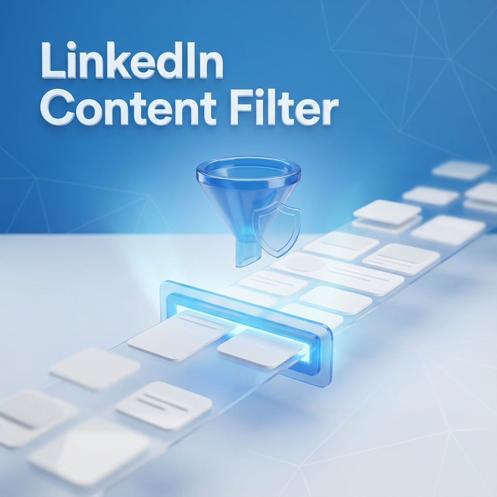

# Changelog

All notable changes to LinkedIn Content Filter will be documented in this file.

## [1.0.0] - 2026-01-06

### 🎉 Initial Release

#### ✨ Features
- **Keyword-Based Filtering**: Filter LinkedIn posts by custom keywords
- **Sidebar Widget**: Native LinkedIn sidebar integration with sticky positioning
- **Real-time Statistics**: 
  - Per-keyword filtering counts with visual badges
  - Session-based filtering counter
  - Lifetime total filtering statistics (persisted across sessions)
- **Visual Feedback**: Posts matching keywords are highlighted before being hidden
- **Smart Validation**: Minimum 3-character requirement for keywords
- **Duplicate Detection**: Prevents adding the same keyword twice

#### 🎨 Design
- LinkedIn-native styling with `artdeco-card` classes
- Custom purple/pink theme (#B02A69)
- Sticky widget in `ad-banner-container` for seamless integration
- Responsive layout with smooth animations

#### 🔧 Technical
- Manifest V3 Chrome Extension
- Async keyword storage with `chrome.storage.sync`
- Persistent lifetime statistics with `chrome.storage.local`
- MutationObserver for dynamic post detection
- Debounced filtering for performance
- Infinite loop prevention for widget updates

#### 🛡️ Bug Fixes
- Fixed infinite loop caused by MutationObserver and setInterval
- Resolved widget list not showing on initial load
- Fixed sticky positioning using LinkedIn's native container
- Improved Turkish character support with `toLocaleLowerCase('tr')`

---

## Release Notes

### What's New in v1.0.0

LinkedIn Content Filter helps you clean up your LinkedIn feed by filtering posts containing unwanted keywords.

**Key Features:**
- ✅ Add unlimited keywords (min 3 characters)
- ✅ Real-time filtering as you scroll
- ✅ Track how many posts each keyword filtered
- ✅ See lifetime statistics across all sessions
- ✅ Native LinkedIn integration - looks like it belongs there!

**Installation:**
1. Download the latest release ZIP
2. Extract to a folder
3. Go to `chrome://extensions/`
4. Enable "Developer mode"
5. Click "Load unpacked"
6. Select the extracted folder
7. Visit LinkedIn and start filtering!

**Usage:**
- Click the extension icon to open the popup
- Or use the sidebar widget on LinkedIn feed pages
- Add keywords you want to filter (min 3 characters)
- Watch your feed get cleaner!

---

### Screenshots

---

### Support

Found a bug or have a feature request? Open an issue on GitHub!

---

### License

MIT License - See LICENSE file for details
